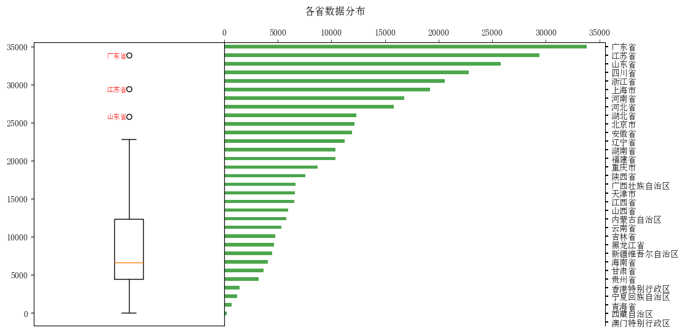

# 简介
本项目旨在利用住房数据，通过深入的数据分析，揭示不同住房类型的空间分布特征以及预测未知住房类型的类型：
1. 通过探索性数据分析（EDA）理解数据中的基本特征和模式。
2. 采用空间分析方法，揭示不同住房类型的空间分布规律。
3. 利用机器学习和深度学习技术对住房类型进行预测。

# 数据概述
- 获取时间：2022年  
- 数据源：二手房网站

| 序号 | 列名                          | 非空值数量    | 数据类型  |
|------|-------------------------------|---------------|-----------|
| 0    | 小区名(name)                   | 334511        | object    |
| 1    | 省份(province)                 | 334511        | object    |
| 2    | 城市(city)                     | 334511        | object    |
| 3    | 区域(area)                     | 334511        | object    |
| 4    | 地址(address)                  | 334511        | object    |
| 5    | 纬度(百度地图)(latitude)       | 329869        | object    |
| 6    | 经度(百度地图)(longitude)      | 329869        | object    |
| 7    | 纬度(GPS)(latitude_gps)        | 323818        | object    |
| 8    | 经度(GPS)(longitude_gps)       | 323821        | object    |
| 9    | 物业类型(type)                 | 334511        | object    |
| 10   | 物业费(management_fee)        | 334511        | object    |
| 11   | 总建面积(size)                 | 334511        | object    |
| 12   | 总户数(houses)                | 334511        | object    |
| 13   | 建造年代(year)                 | 334511        | object    |
| 14   | 停车位(parkings)               | 334511        | object    |
| 15   | 容积率(volume)                 | 334511        | object    |
| 16   | 绿化率(greening)               | 334511        | object    |
| 17   | 开发商(producer)               | 334510        | object    |
| 18   | 物业公司(management)           | 334511        | object    |
| 19   | 相关学校(school)               | 334511        | object    |
| 20   | 小区介绍(info)                 | 334511        | object    |

# 探索性数据分析
  

.png)  

.png)  

# 空间分析
  

  

  

  

  

  

  

  

  

# 住房类型预测
.png)  

.png)  

.png)  
